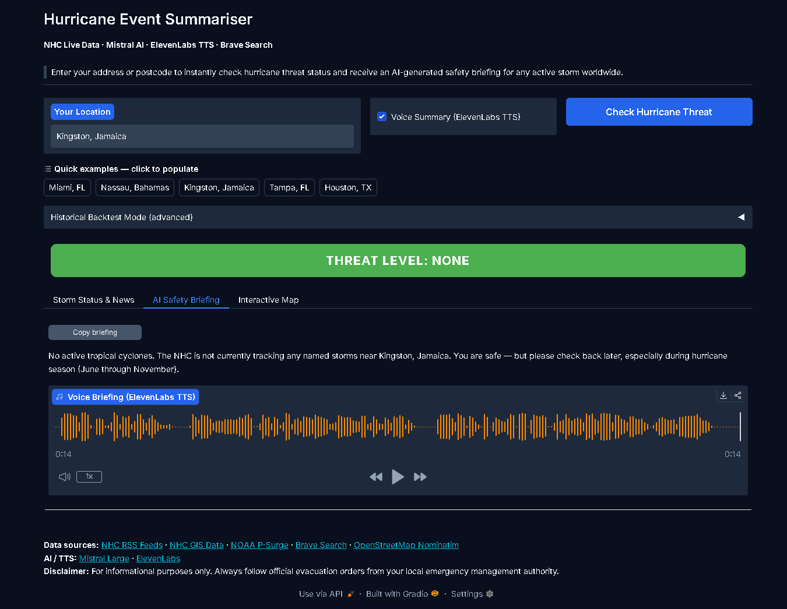
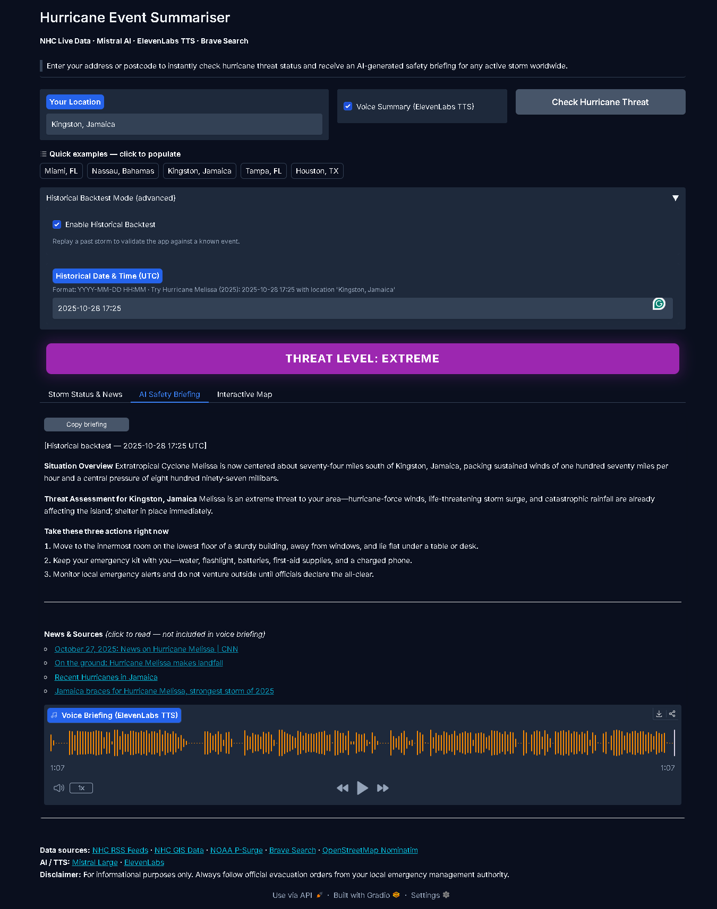

# Hurricane Event Summariser

**[Mistral AI Worldwide Hackathon 2026](https://worldwide-hackathon.mistral.ai/) — Online Edition · "Anything Goes" Track**
*February 28 – March 1, 2026 · Partners: NVIDIA, AWS, ElevenLabs, Hugging Face, Weights & Biases, Supercell*

An AI-powered, real-time hurricane threat assessment tool. Enter any address or postcode to receive an instant, location-specific safety briefing backed by live NHC data, geospatial analysis, and a Mistral-generated voice summary.

> **Coverage note:** Geocoding works for any address worldwide (via OpenStreetMap Nominatim), but storm data is sourced exclusively from the **US National Hurricane Center (NHC)**, which tracks the **Atlantic**, **Eastern Pacific**, and **Central Pacific** basins only. Locations outside these basins (e.g. western Pacific typhoons, Indian Ocean cyclones) will correctly report no active NHC-tracked storms — they are simply outside NHC's remit. During the Atlantic hurricane season (June–November), the app is most relevant for the Caribbean, Gulf of Mexico, US East Coast, and Central America.

---

## What It Does

1. **Geocodes** your location (OpenStreetMap Nominatim — no API key needed).
2. **Fetches live NHC storm data** — RSS advisories + GIS shapefiles (cone of uncertainty, forecast track, watch/warning zones, storm surge polygons).
3. **Intersects your location** against NHC hazard polygons to classify threat level: None / Low / Moderate / High / Extreme.
4. **Queries Brave Search** for the latest hurricane news, filtered to verified live URLs.
5. **Generates an AI safety briefing** via Mistral Large — situation overview, location-specific threat assessment, and three immediate safety actions.
6. **Synthesises a voice briefing** via ElevenLabs TTS (optional).
7. **Renders an interactive Folium map** showing the cone, track points, watch/warning zones, and your pin.
8. **Historical backtest mode** — replay any past storm at a specific date/time using ATCF best-track data and archived NHC GIS advisories.

---

## Demo

The screenshots below walk through both operating modes. Each one shows the complete output of a single button click: threat badge, AI briefing, ElevenLabs voice player, and (in the backtest) live-filtered news results.

---

### Standard mode — no active storms (1 March 2026, Kingston, Jamaica)

**Inputs:** Location `Kingston, Jamaica` · Voice Summary enabled · Historical Backtest off.

The Atlantic hurricane season runs June–November. This run was made on 1 March 2026 — outside peak season — so the NHC is not tracking any active storms in the Atlantic, Eastern Pacific, or Central Pacific basins. The app correctly classifies this as **Threat Level: None** (green badge) and generates a concise all-clear briefing via Mistral Large:

> *"No active tropical cyclones. The NHC is not currently tracking any named storms near Kingston, Jamaica. You are safe — but please check back later, especially during hurricane season (June through November)."*

ElevenLabs synthesises and autoplays a **14-second voice briefing** of that text — visible as the orange waveform in the audio player on the AI Safety Briefing tab. The app automatically switches to this tab when results are ready so the voice plays immediately without any extra click.

This screenshot confirms the full pipeline (geocoding → NHC data fetch → GIS intersection → Mistral → ElevenLabs) runs correctly even when there is nothing threatening to report.



---

### Historical backtest mode — Hurricane Melissa (2025), Kingston, Jamaica

**Inputs:** Location `Kingston, Jamaica` · Historical Backtest enabled · Date `2025-10-28 17:25` UTC.

At that moment, Extratropical Cyclone Melissa was centred approximately 74 miles south of Kingston, packing 170 mph sustained winds and a central pressure of 897 mb. The app fetches the ATCF best-track archive for 2025, interpolates Melissa's exact position at the chosen timestamp, retrieves the archived NHC GIS advisory shapefiles current at that time, and intersects Kingston against the cone and watch/warning polygons. The result is **Threat Level: Extreme** (purple badge).

The Mistral Large briefing generated for that moment reads:

> **Situation Overview:** *"Extratropical Cyclone Melissa is now centred about seventy-four miles south of Kingston, Jamaica, packing sustained winds of one hundred seventy miles per hour and a central pressure of eight hundred ninety-seven millibars."*
>
> **Threat Assessment for Kingston, Jamaica:** *"Melissa is an extreme threat to your area — hurricane-force winds, life-threatening storm surge, and catastrophic rainfall are already affecting the island; shelter in place immediately."*
>
> **Take these three actions right now:**
> 1. *Move to the innermost room on the lowest floor of a sturdy building, away from windows, and lie flat under a table or desk.*
> 2. *Keep your emergency kit with you — water, flashlight, batteries, first-aid supplies, and a charged phone.*
> 3. *Monitor local emergency alerts and do not venture outside until officials declare the all-clear.*

ElevenLabs synthesises a full **1 minute 7 second voice briefing** of the above text, visible in the audio player waveform.

Brave Search results are filtered to articles published **on or before 2025-10-28**, preventing any post-event leakage. The four news links shown in the screenshot are all contemporaneous sources:

- *October 27, 2025: News on Hurricane Melissa — CNN*
- *On the ground: Hurricane Melissa makes landfall*
- *Recent Hurricanes in Jamaica*
- *Jamaica braces for Hurricane Melissa, strongest storm of 2025*

This demonstrates that the historical backtest is not a static replay — it reconstructs the full information environment as it existed at that moment in time.



---

## Tools & Technologies

| Layer | Technology |
|---|---|
| AI summarisation | [Mistral Large](https://docs.mistral.ai/) (`mistral-large-latest`) |
| Voice briefing | [ElevenLabs TTS](https://elevenlabs.io/docs/api-reference/text-to-speech) (`eleven_multilingual_v2`) |
| News search | [Brave Search API](https://api.search.brave.com/app/documentation/web-search/get-started) |
| UI framework | [Gradio Blocks](https://www.gradio.app/docs/gradio/blocks) |
| Interactive map | [Folium](https://python-visualization.github.io/folium/) (OpenStreetMap / CartoDB tiles) |
| Geospatial analysis | [GeoPandas](https://geopandas.org/) + [Shapely](https://shapely.readthedocs.io/) |
| Geocoding | [OpenStreetMap Nominatim](https://nominatim.openstreetmap.org/) (free, no key) |
| Background scheduling | [APScheduler](https://apscheduler.readthedocs.io/) |

---

## Data Sources

| Source | What It Provides |
|---|---|
| [NHC RSS Feeds](https://www.nhc.noaa.gov/aboutrss.shtml) | Live storm advisories for Atlantic, Eastern Pacific, Central Pacific |
| [NHC GIS Shapefiles](https://www.nhc.noaa.gov/gis/) | 5-day cone polygon, forecast track, watch/warning zones, storm surge |
| [ATCF Best Track Archive](https://ftp.nhc.noaa.gov/atcf/btk/) | Historical storm positions for backtest mode |
| [NHC GIS Archive](https://www.nhc.noaa.gov/gis/forecast/archive/) | Archived advisory shapefiles for historical replay |
| [NHC Tropical Outlooks](https://www.nhc.noaa.gov/aboutrss.shtml) | 2-day/5-day graphical outlooks (shown when no active storms) |

All NHC/NOAA data is free and publicly available with no API key.

---

## API Keys Required

Copy `.env.example` to `.env` and fill in your keys:

```
cp .env.example .env
```

| Variable | Required | Where to Get It | Free Tier |
|---|---|---|---|
| `MISTRAL_API_KEY` | **Yes** | [console.mistral.ai](https://console.mistral.ai/) | 15 € free credit |
| `BRAVE_API_KEY` | No — skips news | [api.search.brave.com](https://api.search.brave.com/app/dashboard) | $5 free credit (~1,000 queries) |
| `ELEVENLABS_API_KEY` | No — skips TTS | [elevenlabs.io](https://elevenlabs.io/app/settings/api-keys) | 10,000 chars/month free |
| `NOMINATIM_EMAIL` | Recommended | Your email address | Free (required by Nominatim ToS) |

The app runs with only `MISTRAL_API_KEY`. News search and voice are disabled gracefully when their keys are absent.

---

## Installation & Setup

**Requirements:** Python 3.10 or later.

### Windows PowerShell

```powershell
# 1. Navigate to the project directory
cd "hurricane_tracker"

# 2. Create a virtual environment (recommended)
python -m venv venv
.\venv\Scripts\Activate.ps1

# 3. Install dependencies
pip install -r requirements.txt

# 4. Set up API keys
Copy-Item .env.example .env
notepad .env        # fill in MISTRAL_API_KEY and any optional keys

# 5. Launch the app
python app.py
```

Open **http://localhost:7860** in your browser. The terminal will print an API key validation summary on startup.

**Mobile access:** To use the app from a phone or any device on a different network, set `share=True` in the `demo.launch()` call at the bottom of `app.py`. Gradio will print a temporary public URL (e.g. `https://xxxxxxxx.gradio.live`) valid for 72 hours. The UI has been tested in a mobile browser and is fully responsive — no native app required.

### Running from a Jupyter Notebook

Open `notebooks/05_ui_demo.ipynb`. This notebook contains three options:

- **Option A** — launches the Gradio UI inline inside the notebook cell.
- **Option B** — starts the app as a standalone server at `http://localhost:7860`.
- **Quick function-level demo** — runs the full analysis pipeline in code (no UI) for `Tampa, FL`.

```powershell
# Start Jupyter from the project root
cd "hurricane_tracker"
jupyter notebook notebooks/05_ui_demo.ipynb
```

---

## Project Structure

```
hurricane_tracker/
├── app.py                  # Gradio UI + main analysis pipeline
├── config.py               # API keys, NHC URLs, model config (from .env)
├── data_fetcher.py         # NHC RSS + GIS + Brave Search fetching, TTL cache
├── geocoder.py             # Nominatim free geocoding
├── gis_processor.py        # GeoPandas threat zone intersection + ThreatResult
├── ai_summarizer.py        # Mistral API — context builder + summary generation
├── map_renderer.py         # Folium interactive map builder
├── tts_handler.py          # ElevenLabs TTS
├── historical_fetcher.py   # ATCF best-track parser + archived GIS fetcher
├── scheduler.py            # Background NHC polling utility
├── key_validator.py        # Startup API key health check (console only)
├── requirements.txt        # Python dependencies
├── .env.example            # API key template — copy to .env
├── notebooks/
│   ├── 01_data_ingestion.ipynb     # Live NHC data fetch demo
│   ├── 02_hurricane_tracking.ipynb # Storm discovery + GIS layer demo
│   ├── 03_threat_check.ipynb       # Geospatial threat zone analysis demo
│   ├── 04_summarisation.ipynb      # Mistral AI summarisation demo
│   └── 05_ui_demo.ipynb            # Full Gradio UI launch (start here)
├── tests/
│   ├── test_ai_summarizer.py
│   ├── test_data_fetcher.py
│   └── test_gis_processor.py
└── docs/
    ├── screenshot_standard_mode.png      # Standard mode — no active storms
    └── screenshot_historical_backtest.png # Historical backtest — Hurricane Melissa 2025
```

---

## Historical Backtest Mode

Enable "Historical Backtest Mode" in the UI accordion to replay any past storm:

- **Date format:** `YYYY-MM-DD HH:MM` (UTC)
- **Example — Hurricane Melissa (2025):** date `2025-10-28 17:25`, location `Kingston, Jamaica`

The app fetches the ATCF best-track file for the requested year, interpolates the storm's exact position at the chosen moment, and retrieves the NHC archived GIS advisory that was current at that time. News results are filtered to articles published on or before the selected date, preventing any post-event leakage.

---

## Hackathon Submission

This project was submitted to the **[Mistral AI Worldwide Hackathon 2026](https://worldwide-hackathon.mistral.ai/) — Online Edition**.

**Track: Anything Goes**
> *"Use Mistral models through the API or OSS tools to create the best demos."*

This project uses `mistral-large-latest` (Mistral Large 3) via the Mistral API — fully aligned with the track requirements.

**Submission & community links:**
- Registration: [hackiterate.com](https://hackiterate.com/invite/63f20b24c20257b1c09c1350bb7ca261ffad93c8c507bd8a83828ce8cf6de80a)
- Discord (online edition updates): [discord.gg/zdSEmdfkSQ](https://discord.gg/zdSEmdfkSQ)
- Hugging Face org (credits): [mistral-hackaton-2026](https://huggingface.co/organizations/mistral-hackaton-2026/share/BuptMvYnpxCEnTMuOumANgOGHPDbrgMwoS)

**Online winner announced:** Friday, 6 March 2026.

**Online track prizes:**
| Place | Cash | Mistral Credits | Bonus |
|---|---|---|---|
| 1st | $1,500 | $3,000 | 3 months ElevenLabs Pro |
| 2nd | $1,000 | $2,000 | — |
| 3rd | $500 | $1,000 | — |

**Global winner** (across all tracks and cities): $10,000 cash + $15,000 Mistral credits + hiring opportunity at Mistral + Supercell AI Innovation Lab interview.

**Special category prizes** relevant to this project:
- *Best Voice Use Case* — $2,000–$6,000 ElevenLabs credits (this project uses ElevenLabs TTS)

**Judging criteria** (equal weight): Impact · Technical Implementation · Creativity · Pitch quality.

**Submission requirements:** GitHub repository + project description. Video is optional.

---

## Future Development

### Broader storm coverage
The most impactful single extension would be adding the **Joint Typhoon Warning Center (JTWC)** feed for western Pacific typhoons and North Indian Ocean cyclones, alongside the **Indian Meteorological Department (IMD)** for the Bay of Bengal. This would make the app genuinely global rather than NHC-basin-only. The GIS pipeline, threat classifier, and map renderer are already generic — only the data fetching layer would need new adapters.

### Richer NHC data
NHC publishes data that the app does not yet parse: **probabilistic wind speed exceedance grids** (probability of experiencing ≥34/50/64 kt winds), **rainfall QPF** from the NWS, and **USGS stream gauge readings** for inland flood risk. Layering these onto the existing GeoPandas pipeline would give a more complete picture of total storm impact beyond surge and wind warnings.

### Voice-native AI with Voxtral
The current TTS pipeline (ElevenLabs) converts Mistral's *text* output to speech. A natural upgrade is **Mistral Voxtral** (or Voxtral-Realtime), which is voice-native end to end — enabling the user to speak their location rather than type it, and receive a spoken briefing without a separate TTS service. This would also open the app to visually impaired users and truly hands-free use during an emergency.

### Satellite and radar imagery analysis
Mistral's vision-capable models could analyse **NOAA CoastWatch satellite imagery** or NWS radar composites directly — providing a visual situational awareness layer beyond what the text advisories contain, and letting the AI describe what it sees in the imagery as part of the briefing.

### Active push notifications
`notifier.py` (Gmail SMTP alert logic) exists in the codebase but is not wired to the UI. A small addition would let users register a location and receive an email — or SMS via Twilio — the moment a new storm enters a threat zone around their address, without having to manually re-check the app.

### Historical impact enrichment
The historical backtest mode currently replays storm tracks and archived GIS advisories. Pairing this with **NOAA post-storm damage reports** and **SHELDUS** (Spatial Hazard Events and Losses Database) would let the app show what actually happened at a location — casualties, economic losses, power outages — turning the backtest into a genuine impact retrospective rather than a meteorological replay only.

### Multi-language briefings
A single `generate_hurricane_summary()` call with a language instruction appended to the system prompt would produce briefings in Spanish, French, Haitian Creole, or any other language — critical for Caribbean and Central American populations who are most exposed to Atlantic hurricanes and may not be English-first.

---


For informational and demonstration purposes only. Always follow official evacuation orders from your local emergency management authority.
